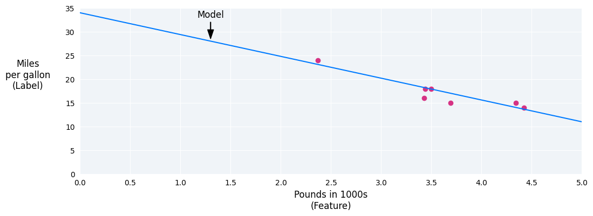
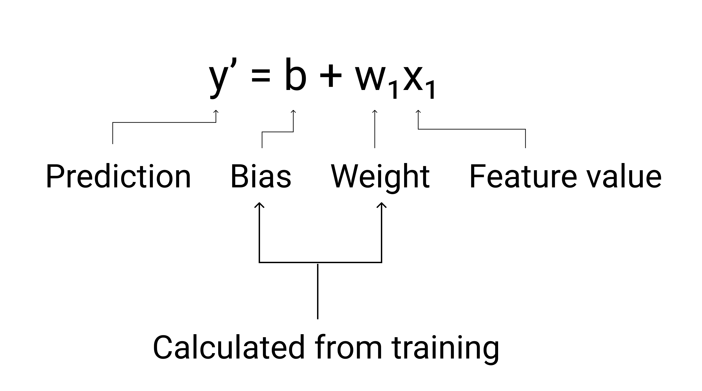
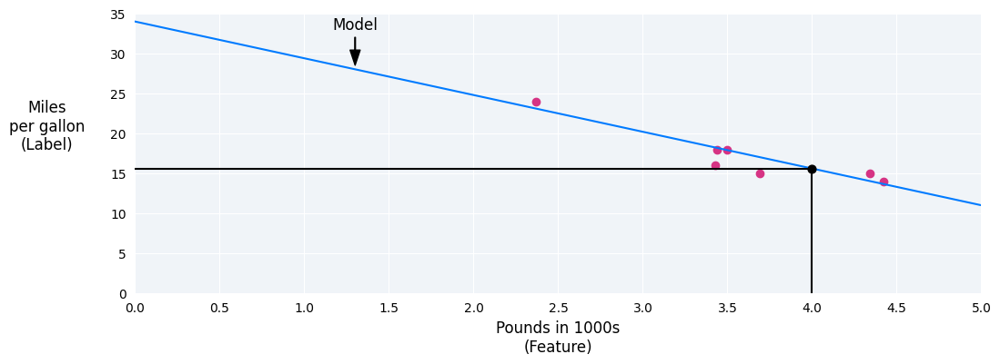
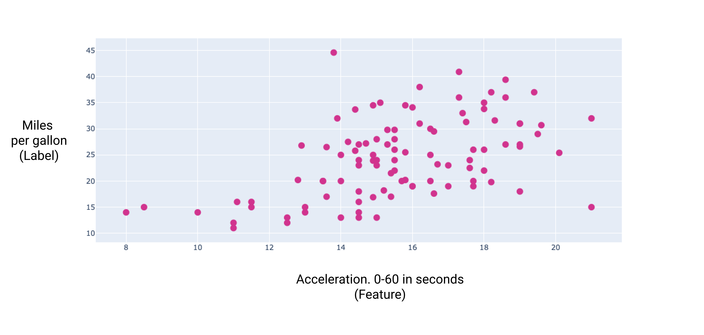
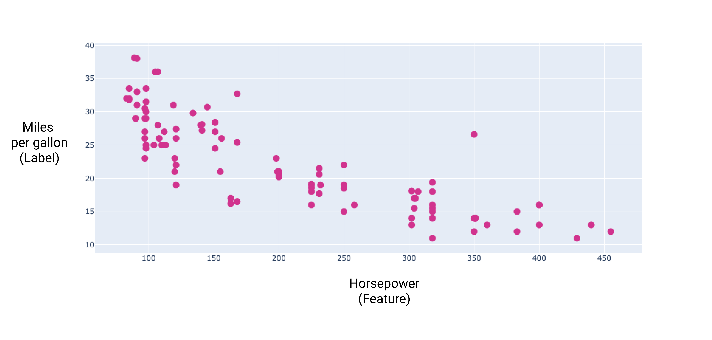

Linear Regression is a Technique used to find Relationship between varaibles.In an ML context,linear Regression is used to find relationship between features of data to the label.
For example,if we want to predict a cars fuel efficiency in miles per gallon based on how heavy the car is we have the following dataset.

Pounds in 1000s(features)|Miles per gallon(label)|
-------------------------|------------------------
3.5                      |18
-------------------------|------------------------
3.69                     |15
-------------------------|------------------------
3.44                     |18
-------------------------|------------------------
3.43                     |16
-------------------------|------------------------
4.34                     |15
-------------------------|------------------------
4.42                     |14
-------------------------|------------------------
2.37                     |24

The plotted graph below

Car heaviness(in pounds) versus miles per gallon decreases as car get heavier

Linear regression equation:
The formula is given by y=mx+b
-> y is miles per gallon we want to predict
-> m is the slope of the line
-> x is the pounds -our input value
-> b is the y interscept.

But in Machin Learning , the equation for the model is given as y' = b+w1x1
where 
-> y' is the predicted outcome.
-> b is bias its serves as a parameter for the model and its calculated during training of the model.
-> w1 is called weight and its the same concept of slope(m) its also serves as a parameter for the model during training.
-> x1 is the feature of the data
During training the model calculates the best weight and bias that brings the best model built on that data

In our example we calculated the weights and bias from the line we drew.The bias is 34 (where the line intersects with the y-axis),and the weight is -4.6(the slope of the line).The model defined as y'=34+(-4.6)(x1),and we could use it to make predictions.For instance , using this model,a 4,000 pound car would have a predicted fuel efficiency of 15.6 miles per gallon.

Models with multiple features
Although the example in this section uses only one feature—the heaviness of the car—a more sophisticated model might rely on multiple features, each having a separate weight (w1,w2 etc.)

For example, a model that predicts gas mileage could additionally use features such as the following:

-> Engine displacement
-> Acceleration
-> Number of cylinders
-> Horsepower
This model would be written as follows:

. A model with five features to predict a car's miles per gallon rating.

By graphing some of these additional features, we can see that they also have a linear relationship to the label, miles per gallon:

 A car's displacement in cubic centimeters and its miles per gallon rating. As a car's engine gets bigger, its miles per gallon rating generally decreases.

 igure 7. A car's acceleration and its miles per gallon rating. As a car's acceleration takes longer, the miles per gallon rating generally increases.

Figure 8. Horsepower graphed against miles per gallon showing a negative linear relationship.