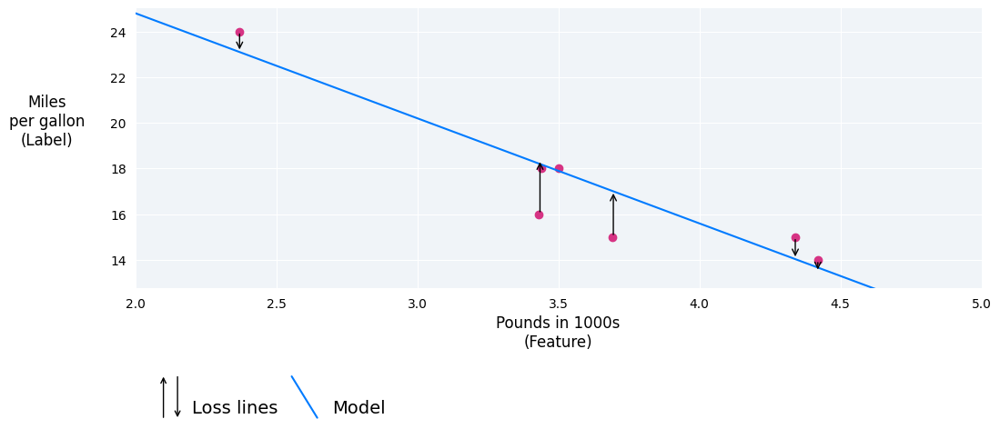
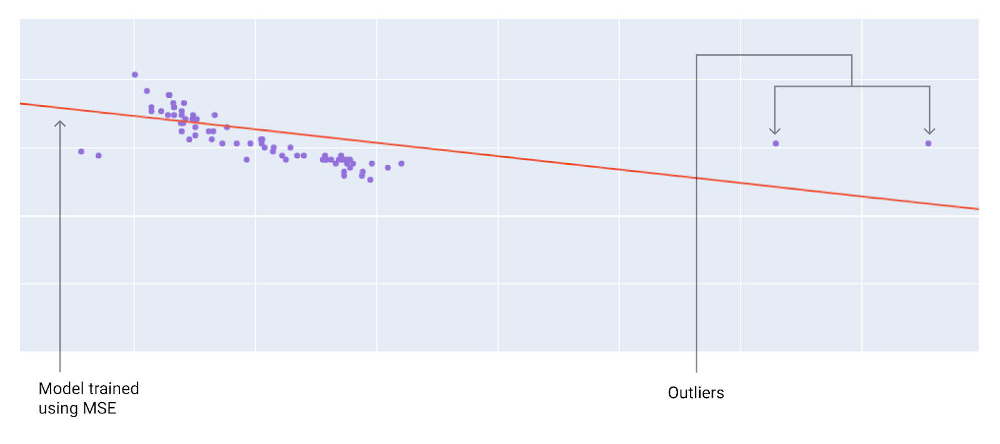
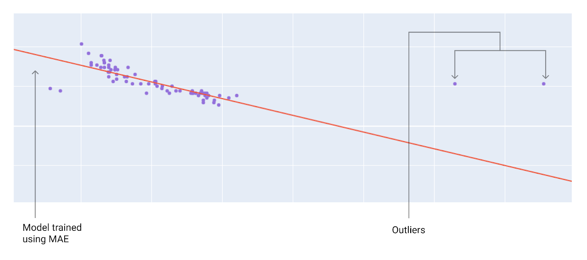

loss is a numerical metric that describes how wrong a model's predictions are. Loss measures the distance between the model's predictions and the actual labels. The goal of training a model is to minimize the loss, reducing it to its lowest possible value.

In the following image, you can visualize loss as arrows drawn from the data points to the model. The arrows show how far the model's predictions are from the actual values.

In stastistics and machine learning loss helps to calcualte the difference between the actual values to the predicted values.For example if the actual value is 5 and the predicted is 5 ,the difference actual(5)-predicted(3) 
 which will give loss (3).Whencalculating the loss the sign absolute.
 
In linear Regression There are four main kinds of loss which are :
1.L1 lOSS :The some of the absolute values of the difference between the predicted value and the actual value
2.Mean absolute error(MAE):The average of L1 loss to the number of element in the set.
3.L2 :The sum of the squared difference between the predicted and the actual values.
4.Mean squared error :The average of L2 accross the number of elements in the set

Calculating loss example
Using the previous best fit line, we'll calculate L2 loss for a single example. From the best fit line, we had the following values for weight and bias:

If the model predicts that a 2,370-pound car gets 23.1 miles per gallon, but it actually gets 26 miles per gallon, we would calculate the L2 loss as follows:
Value         |Equation                 |Results
Prediction    |Bias+(weight*featre)     |23.1
Actual        |34+(-4.6*2.37)           |26
L1loss        |(actual-predicted value) |2.9

In this example the l1loss is 2.9

Choosing a loss
Deciding whether to use MAE or MSE can depend on the dataset and the way you want to handle certain predictions. Most feature values in a dataset typically fall within a distinct range. For example, cars are normally between 2000 and 5000 pounds and get between 8 to 50 miles per gallon. An 8,000-pound car, or a car that gets 100 miles per gallon, is outside the typical range and would be considered an outlier.

An outlier can also refer to how far off a model's predictions are from the real values. For instance, 3,000 pounds is within the typical car-weight range, and 40 miles per gallon is within the typical fuel-efficiency range. However, a 3,000-pound car that gets 40 miles per gallon would be an outlier in terms of the model's prediction because the model would predict that a 3,000-pound car would get around 20 miles per gallon.

When choosing the best loss function, consider how you want the model to treat outliers. For instance, MSE moves the model more toward the outliers, while MAE doesn't. L2 loss incurs a much higher penalty for an outlier than L1 loss. For example, the following images show a model trained using MAE and a model trained using MSE. The red line represents a fully trained model that will be used to make predictions. The outliers are closer to the model trained with MSE than to the model trained with MAE.
Figure 10. A model trained with MSE moves the model closer to the outliers.

A model trained with MAE is farther from the outliers
Note the relationship between the model and the data
->MSE:The model moves twords the outliers and further away from the data points
->MAE: The model is further away from the outliers and closer to the data points

NOTE:
. Check for Outliers
If your dataset has a lot of outliers (extreme values in your target variable) →
Use MAE — it won’t let those big errors dominate the loss.

If your dataset is clean (few or no outliers) →
Use MSE — you can afford to let the model focus more on avoiding large mistakes.

2. Decide on Error Sensitivity
If big mistakes are MUCH worse than small ones in your problem, use MSE (squares make large errors count more).

If all mistakes are equally bad, use MAE.

Example:

Predicting delivery times for customers → Being off by 1 hour vs. 5 hours is very different → MSE.

Predicting daily temperature → Being off by 2°C vs. 4°C is proportionally bad → MAE.

3. Optimization Considerations
MSE has a smooth gradient → Often converges faster for gradient-based learning.

MAE has a constant gradient (except at zero) → Can be slower, especially with stochastic gradient descent.

4. Interpretability
MAE is in the same units as your target variable → Easier to explain results to non-technical people.

MSE’s units are squared → Not directly interpretable without taking the square root (RMSE).

